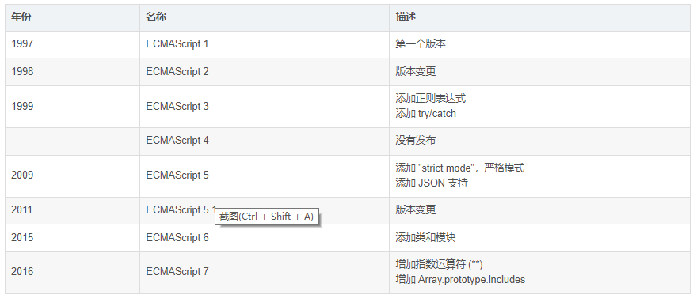
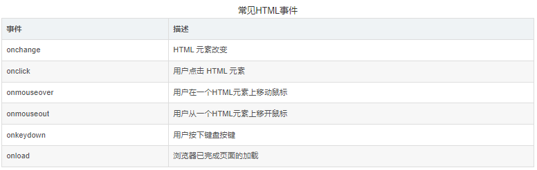
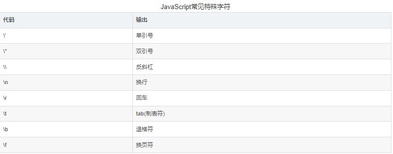
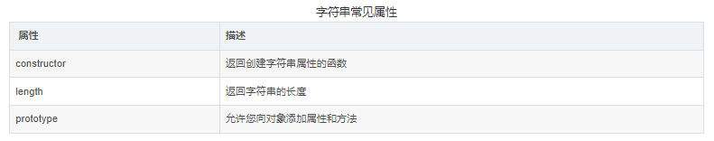
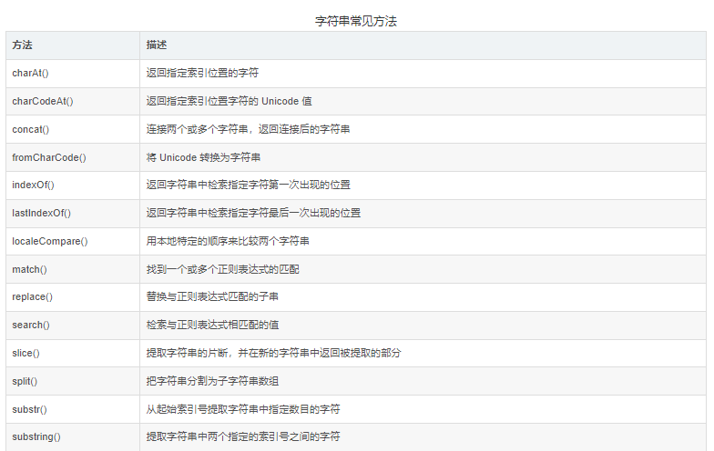
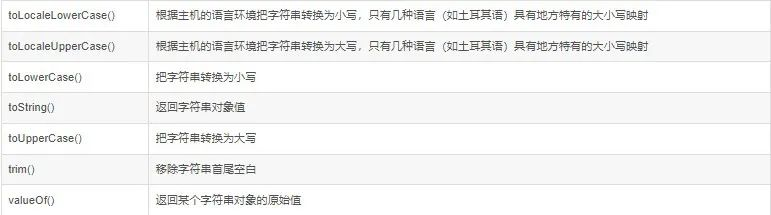
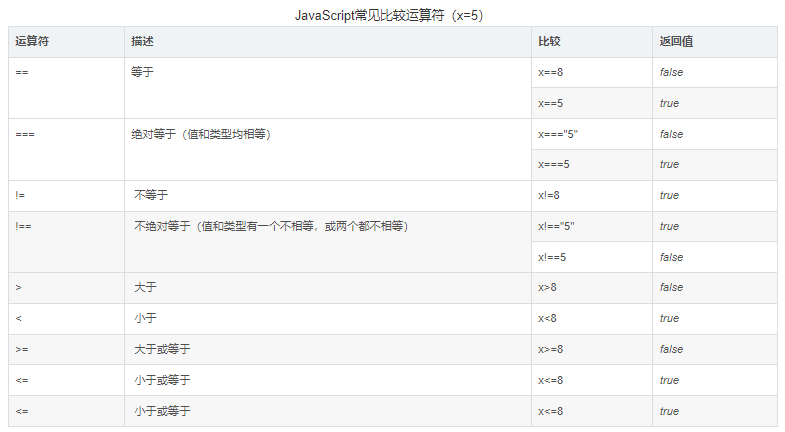
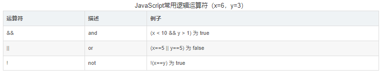

## **介绍**

JavaScript 是互联网上最流行的脚本语言，这门语言可用于 HTML 和 web，更可广泛用于服务器、PC、笔记本电脑、平板电脑和智能手机等设备。

### **JavaScript 特点**

JavaScript 是一门脚本语言。

JavaScript 是一种轻量级的编程语言。

JavaScript 是可插入 HTML 页面的编程代码。

JavaScript 插入 HTML 页面后，可由所有的现代浏览器执行。

JavaScript 很容易学习。

JavaScript 已经由 ECMA（欧洲电脑制造商协会）通过 ECMAScript 实现语言的标准化。



## **用法**

HTML 中的脚本必须位于 `<script>` 与 `</script>` 标签之间。脚本可被放置在 HTML 页面的 `<body></body>` 和 `<head></head>` 部分中。

通常，我们需要在某个事件发生时执行代码，比如当用户点击按钮时。如果我们把 JavaScript 代码放入函数中，就可以在事件发生时调用该函数。

### 实例 1：head 中的 script 函数

```html
<!DOCTYPE html>
<html lang="en">
  <head>
    <meta charset="UTF-8" />
    <title>head标签中script</title>
    <script>
      function myFunction() {
        document.getElementById("demo").innerHTML = "这是我的函数";
      }
    </script>
  </head>
  <body>
    <h1>我的函数</h1>
    <p id="demo">一段话</p>
    <button type="button" onclick="myFunction()">这是函数</button>
  </body>
</html>
```

### 实例 2：body 中的 script 函数

```html
<!DOCTYPE html>
<html lang="en">
<head>
<meta charset="UTF-8">
<title>body中的script</title>
</head>
<body>
<h1>我的函数</h1>
    <p id="demo">我的函数</p>
    <button type="button" onclick="myFunction()">点击一下</button>
    <script>
        function myFunction() {
            document.getElementById("demo").innerHTML = "这是我的函数"
        }
    </script>
</body>
</html
```

JavaScript 也可以放在外部供调用，注意外部拓展名为.js。

### 实例 3：外部调用 JavaScript

外部调用.js

```csharp
function myFunction() {    document.getElementById('demo').innerHTML = "这是我的函数"}
```

调用外部 script

```html
<!DOCTYPE html>
<html lang="en">
  <head>
    <meta charset="UTF-8" />
    <title>调用外部script</title>
  </head>
  <body>
    <p id="demo">一段文字</p>
    <button type="button" onclick="myFunction()">尝试一下</button>
    <script src="外部脚本.js"></script>
  </body>
</html>
```

## **输出**

JavaScript 可以通过不同的方式来输出数据：

使用 window.alert() 弹出警告框。

使用 document.write() 方法将内容写到 HTML 文档中。

使用 innerHTML 写入到 HTML 元素。

使用 console.log() 写入到浏览器的控制台。

### 实例 1：aler()弹窗输出

```html
<!DOCTYPE html>
<html lang="en">
  <head>
    <meta charset="UTF-8" />
    <title>alert输出</title>
  </head>
  <body>
    <h1>alert输出</h1>
    <script>
      window.alert(5 + 6);
    </script>
  </body>
</html>
```

### 实例 2：document.write()输出

```html
<!DOCTYPE html>
<html lang="en">
  <head>
    <meta charset="UTF-8" />
    <title>document.write输出</title>
  </head>
  <body>
    <h1>document.write输出</h1>
    <script>
      document.write(Date());
      document.write("Hello,Web!");
    </script>
  </body>
</html>
```

### 实例 3：写到 HTMl 文档

```html
<!DOCTYPE html>
<html lang="en">
  <head>
    <meta charset="UTF-8" />
    <title>写到HTMl文档</title>
  </head>
  <body>
    <h1>写到HTMl文档</h1>
    <script>
      function myFunction() {
        document.write("函数输出");
      }
    </script>
    <button onclick="myFunction()">点击这里</button>
  </body>
</html>
```

### 实例 4：使用 console.log() 写入到浏览器的控制台

```html
<!DOCTYPE html>
<html lang="en">
  <head>
    <meta charset="UTF-8" />
    <title>使用console.log()写入到浏览器的控制台</title>
  </head>
  <body>
    <h1>console.log()写入到浏览器的控制台</h1>
    <script>
      a = 5;
      b = 6;
      c = a + b;
      console.log(c);
    </script>
  </body>
</html>
```

## **语法介绍**

JavaScript 是一个脚本语言，它是一个轻量级，但功能强大的编程语言。

### **字面量**

在编程语言中，一般固定值称为[字面量](https://so.csdn.net/so/search?q=字面量&spm=1001.2101.3001.7020)。

数字（Number）字面量：可以是整数或者是小数，或者是科学计数(e)。如 3.14，5.88 等。

字符串（String）字面量：”可以使用单引号或双引号。如"Hello"，"Web"等

表达式字面量：用于计算的固定值。3 + 2.2, 3.14 \* 2 等。

数组（Array：字面量：定义一个数组。如[1, 2, 3, 4, 5, 6]。

对象（Object：字面量：定义一个对象。如{firstName:"John", lastName:"Doe", age:50, eyeColor:"blue"}。

函数（Function）字面量：定义一个函数。如 function myFunction(a, b) { return a \* b; }。

注意，在 JavaScript 中，语句需要加结束符“；”。

### **JavaScrip 变量**

在编程语言中，变量用于存储数据值。JavaScript 使用关键字 var 来定义变量， 使用等号来为变量赋值，变量之间可以相互操作：

```js
var y = false; // 布尔值
var length = 16; // 数字
var points = x * 10; // 数字计算
var lastName = "Johnson"; // 字符串
var cars = ["Saab", "Volvo", "BMW"]; // 数组
var person = { firstName: "John", lastName: "Doe" }; // 对象字典
```

### **JavaScript 函数**

为了能够重复引用相同的功能，减少代码的书写和维护的方便，JavaScript 提供函数功能，由关键字 function 引导：

```js
function myFunc(a, b) {
  return a + b; // 返回a+b结果
}
```

### **JavaScript 特点**

相对其它语言，JavaScript 具有下列特点：

JavaScript 对大小写敏感。

JavaScript 使用 Unicode 字符集。

JavaScript 推荐使用驼峰命名法定义变量，命名避免关键字。

JavaScript 属于弱类型语言，定义变量都是 var 关键字。

<!--


 -->

### **JavaScript 注释（与 Java 相同）**

// 这是代码：单句注释，在编辑器一般是 ctrl + L 键。

/_ 这是代码 _/：多行注释，在编辑器一般是 ctrl + shift + L 键。

**语句**

JavaScript 语句向浏览器发出的命令，告诉浏览器该做什么。下面的 JavaScript 语句向 id="demo"的 HTML 元素输出文本"Hello World!" ：

```js
document.getElementById("demo").innerHTML = "Hello World!";
```

与 Python 不同的是，JavaScript 代码块都是在大括号中的，这点像极了 Java。

### Java 标识符

<!--


 -->

大部分语言能够自动补全空格，我们建议在运算符两边加上空格，这样清晰美观，但是要注意在 HTML 中空格的是要留意用法的，切勿混谈。在 JavaScript 中，下面两句话是一样的：

```js
var a = 10;
var b = 10;
```

与 Python 相似，JavaScript 也是脚本语言，属于解释型。

## **对象**

**定义对象**

任何事物都是对象，具有相同特点的事物中抽象出来的一个特点实例。如人类中的小明。

在 JavaScript 中，对象就是是属性变量的容器，类似 Python 中的字典，Java 中的哈希映射，其中定义了对象的属性。

```js
var people = {
  firstName: "Mike",
  lastName: "Smith",
  age: "18",
  address: "Beijing",
  job: "Student",
};
```

以上就是对象定义，当然你也可以写作一行，我这样是为了美观，以后也强烈大家这样写。

### **访问对象属性**

可以说 "JavaScript 对象是变量的容器"。但是，我们通常认为 "JavaScript 对象是键值对的容器"。键值对通常写法为 key : value(键与值以冒号分割)，键值对在 JavaScript 对象通常称为对象属性。我们访问属性也是通过万能的" . "（大部分语言都是用的这个）。

```html
<!DOCTYPE html>
<html lang="en">
  <head>
    <meta charset="UTF-8" />
    <title>这是网站</title>
  </head>
  <body>
    <h1>访问类属性</h1>
    <p id="demo"></p>
    <script>
      var people = {
        firstName: "Mike",
        lastName: "Smith",
        age: "18",
        address: "Beijing",
        job: "Student",
      };
      document.getElementById("demo").innerHTML =
        people["firstName"] + "." + people.lastName;
    </script>
  </body>
</html>
```

两种访问方式, 你可以使用 对象名 .property 或 对象名.["property"] 。

## **函数**

函数是由事件驱动的或者当它被调用时执行的可重复使用的代码块。当调用该函数时，会执行函数内的代码。可以在某事件发生时直接调用函数（比如当用户点击按钮时），并且可由 JavaScript 在任何位置进行调用。

### **参数与返回值**

在调用函数时，您可以向其传递值，这些值被称为参数，参数个数不限。

```js
function myFunction(var1, var2) {
  代码;
}
```

参数在调用时，应该严格按照其顺序传参，如下所示：

```html
<!DOCTYPE html>
<html lang="en">
  <head>
    <meta charset="UTF-8" />
    <title>这是一个JavaScript网站</title>
  </head>
  <body>
    <h1>函数参数传递问题</h1>
    <p>点击下面按钮调用</p>
    <button onclick="myFunc('Mike','18','Beijing')">点击这里</button>
    <script>
      function myFunc(name, age, address) {
        alert(
          "My name is " +
            name +
            ", age is " +
            age +
            " and my home is in " +
            address
        );
      }
    </script>
  </body>
</html>
```

[JavaScript 函数](https://so.csdn.net/so/search?q=JavaScript函数&spm=1001.2101.3001.7020)允许有返回值，返回关键字为 return。当函数返回值后，函数将停止执行，在 return 后面的语句将不会被执行。

### 实例：计算两个数的乘积并返回结果

```html
<!DOCTYPE html>
<html lang="en">
  <head>
    <meta charset="UTF-8" />
    <title>JavaScript网站</title>
  </head>
  <body>
    <h1>计算两个数的值返回</h1>
    <p id="demo"></p>
    <script>
      function myFunc(a, b) {
        return a * b;
      }
      document.getElementById("demo").innerHTML = myFunc(3, 4);
    </script>
  </body>
</html>
```

## **变量**

**JavaScript 变量分为两种：**

全局变量：在函数外声明的变量是全局变量，网页上的所有脚本和函数都能访问它。

局部变量：在 JavaScript 函数内部声明的变量（使用 var）是局部变量，所以只能在函数内部访问它。

当我们向未声明的 JavaScript 变量分配值时，该变量将被自动作为 window 的一个属性。如下列语句：

```js
name = "Mike";
```

将声明 window 的一个属性 name。非严格模式下给未声明变量赋值创建的全局变量，是全局对象的可配置属性，可以删除。如：

```js
var var1 = 1; // 不可配置全局属性
var2 = 2; // 没有使用 var 声明，可配置全局属性
console.log(this.var1); // 1
console.log(window.var1); // 1
delete var1; // false 无法删除
console.log(var1); //1
delete var2;
console.log(delete var2); // true
console.log(var2); // 已经删除 报错变量未定义
```

## **事件描述**

HTML 事件是发生在 HTML 元素上的事情。当在 HTML 页面中使用 JavaScript 时， JavaScript 可以触发这些事件。

HTML 事件可以是浏览器行为，也可以是用户行为。以下是 HTM 事件的实例：

HTML 页面完成加载

HTML input 字段改变时

HTML 按钮被点击

通常，当事件发生时，你可以做些事情。在事件触发时 JavaScript 可以执行一些代码。HTML 元素中可以添加事件属性，使用 JavaScript 代码来添加 HTML 元素。

单引号：`<some-HTML-element some-event='JavaScript 代码'>`

双引号：`<some-HTML-element some-event="JavaScript 代码">`

```html
<!DOCTYPE html>
<html lang="en">
  <head>
    <meta charset="UTF-8" />
    <title>JavaScript事件</title>
  </head>
  <body>
    <h1>JavaScript事件处理两种方式</h1>
    <p id="demoOne"></p>
    <button onclick="getElementById('demoOne').innerHTML=Date()">
      点击查看时间1
    </button>
    <p id="demoTwo"></p>
    <button onclick="this.innerHTML=Date()">点击查看时间2</button>
  </body>
</html>
```

JavaScript 通常是多行代码，比较差常见的就是通过事件属性调用。

```html
<!DOCTYPE html>
<html lang="en">
  <head>
    <meta charset="UTF-8" />
    <title>JavaScript事件</title>
  </head>
  <body>
    <h1>JavaScript事件之属性调用</h1>
    <p>点击执行<em>myFunc()</em>函数</p>
    <button onclick="myFunc()">点击这里</button>
    <p id="one"></p>
    <script>
      function myFunc() {
        document.getElementById("one").innerHTML = Date();
      }
    </script>
  </body>
</html>
```



后续会继续学习更多事件。

### **事件作用**

事件可以用于处理表单验证，用户输入，用户行为及浏览器动作：

页面加载时触发事件

页面关闭时触发事件

用户点击按钮执行动作

验证用户输入内容的合法性

可以使用多种方法来执行 JavaScript 事件代码：

HTML 事件属性可以直接执行 JavaScript 代码

HTML 事件属性可以调用 JavaScript 函数

你可以为 HTML 元素指定自己的事件处理程序

你可以阻止事件的发生

## **字符串**

字符串：一系列字符的集合。

```js
var a = "abc";
var b = "Hello";
```

与 Python 类似，可以使用索引来访问字符串中的每个字符：

```js
var c = b[1]; // e
```

**length**

该属性可以计算字符串的长度。

```html
<!DOCTYPE html>
<html>
  <head>
    <meta charset="utf-8" />
    <title>字符串长度</title>
  </head>
  <body>
    <script>
      var txtOne = "Hello World!";
      document.write("<p>" + txtOne.length + "</p>");
      var txtTwo = "ABCDEFGHIJKLMNOPQRSTUVWXYZ";
      document.write("<p>" + txtTwo.length + "</p>");
    </script>
  </body>
</html>
```

JavaScript 也有一些特殊字符，例如当我们要打印引号时，需要加上“\”来进行转义，否则编译器无法解析。



### **字符串作为对象**

通常，JavaScript 字符串是原始值，可以使用字符创建：var firstName = "Mike"，但我们也可以使用 new 关键字将字符串定义为一个对象：var firstName = new String("Mike")，这点与 Java 类似。







## **==与===区别**

1、对于 string、number 等基础类型，== 和 === 是有区别的

a）不同类型间比较，==之比较"转化成同一类型后的值"看"值"是否相等，===如果类型不同，其结果就是不等。

b）同类型比较，直接进行 "值" 比较，两者结果一样。

2、对于 Array, Object 等高级类型，== 和 === 是没有区别的进行 "指针地址" 比较

3、基础类型与高级类型，== 和 === 是有区别的

a）对于 ==，将高级转化为基础类型，进行 "值" 比较

b）因为类型不同，=== 结果为 false

4、!= 为 == 的非运算，!== 为 === 的非运算

```js
var num=1；
var str="1"；
var test=1；
test == num //true　相同类型　相同值
test === num //true　相同类型　相同值
test !== num //false
// test与num类型相同，其值也相同,　非运算肯定是false
num == str //true
// 　把str转换为数字，检查其是否相等。
num != str //false == 的 非运算
num === str //false 类型不同，直接返回false
num !== str //true num 与 str类型不同
// 意味着其两者不等　非运算自然是true啦
```

## 运算符





JavaScript 还包含了基于某些条件对变量进行赋值的条件运算符。如：

```js
var iablename = condition ? value1 : value2;
```

# **其他补充：**

## 字符串拼接的几种方式

> 在 JavaScript 中，使用[字符串](https://so.csdn.net/so/search?q=字符串&spm=1001.2101.3001.7020)连接有 几 种方式：连接符（+）、反引号（`）、join()、concat()。

**一、使用连接符 “+” 把要连接的字符串连起来**

```js
let a = 'java' let b = a + 'script' //运行结果：javascript
```

说明：只连接 100 个以下的字符串建议用这种方法，最方便

**二、使用模板字符串，以反引号（ ` ）标识**

ES6 中新增的字符串方法，可以配合反单引号完成拼接字符串的功能

反单引号怎么打出来：将输入法调整为英文输入法，单击键盘上数字键 1 左边的按键。

用法：

1： 定义需要拼接进去的字符串变量

2： 将字符串变量用${}包起来，再写到需要拼接的地方

注意：反单引号：` ；单引号：' 。不要用错了哟~

实例：

```js
let a = 'java' let b = `hello ${a}script` //运行结果：hello javascript
```

**三、使用数组的 join() 方法连接字符串**

**定义和用法：**

join() 方法将数组作为字符串返回。

元素将由指定的分隔符分隔。默认分隔符是逗号 (, )。

注释：join() 方法不会改变原始数组。

**语法：**

```js
array.join(separator);
```

**参数：**

| 参数      | 描述                                             |
| --------- | ------------------------------------------------ |
| separator | 可选。要使用的分隔符。如果省略，元素用逗号分隔。 |

**返回值：**

| 类型   | 描述                                       |
| ------ | ------------------------------------------ |
| String | 字符串值，表示数组值，由指定的分隔符分隔。 |

**实例：**

```html
let arr = ['hello','java','script'] let str = arr.join(" ") //运行结果：hello
java script
```

**四、使用 JavaScript 的 concat() 方法连接字符串**

**定义和用法：**

[concat](https://so.csdn.net/so/search?q=concat&spm=1001.2101.3001.7020)() 方法用于连接两个或多个字符串。

该方法没有改变原有字符串，但是会返回连接两个或多个字符串新字符串。

注释：concat() 方法不会修改原字符串的值，与数组的 concat() 方法操作相似。

**语法：**

```html
string.concat(string1, string2, ..., stringX)
```

**参数：**

| 参数                           | 描述                                               |
| ------------------------------ | -------------------------------------------------- |
| string1, string2, ..., stringX | 必需。将被连接为一个字符串的一个或多个字符串对象。 |

**返回值：**

| 类型   | 描述                                   |
| ------ | -------------------------------------- |
| String | 两个或多个字符串连接后生成的新字符串。 |

**实例：**

```html
let a = 'java' let b = 'script' let str = a.concat(b)
```

## ES6 与 JavaScript 区别：

**一、概述**

首先需要搞清楚如下几个问题

（1）什么是 javascript?

重新认识一下 javascript，定义是 javascript 是一种弱类型的脚步语言，用于动态渲染 html。仅此而已？更深入了解的话，发现其实 javascript 由核心（ESMAScript）、文档对象模型（DOM）和浏览器对象模型（BOM）三部分组成。

（2）什么是 ES6

ES 全称[ECMAScript](https://so.csdn.net/so/search?q=ECMAScript&spm=1001.2101.3001.7020)，ES6 是它的第六个版本（以下简称 ES6），它是 JavaScript 语言的下一代标准，已经在 2015 年 6 月正式发布了，所以 ES6 也称为 ES2015。Mozilla 公司将在这个标准的基础上，推出 JavaScript 2.0。除此之外还有 ES 还有其他版本，像 ES5 等，目前 ES6 还不被大多数浏览器兼容。

（3）ES6 和 JavaScript 的关系

简单一句话总结就是，ECMAScript（ES）是 JavaScript 语言的国际标准，JavaScript 是 ECMAScript 的实现。所以 ES6 是 JavaScript 的一个实现标准。更准确来说 JavaScript 由核心（ESMAScript）、文档对象模型（DOM）和浏览器对象模型（BOM）三部分组成。